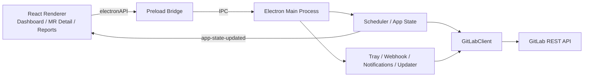

# Project Architecture

เอกสารนี้อธิบายโครงสร้างและเส้นทางการทำงานของ GitLab MR Manager สำหรับใช้เป็นจุดเริ่มต้นในการอ่านโค้ดและพัฒนาฟีเจอร์ต่อ

## ภาพรวม

GitLab MR Manager เป็น Electron desktop application สำหรับติดตามและจัดการ GitLab Merge Requests บน Windows, macOS และ Linux โดยแบ่งการทำงานออกเป็น Electron main process, React renderer process และ preload bridge อย่างชัดเจน



## โครงสร้างไดเรกทอรี

```text
gitlab-req-manager/
├── src/
│   ├── main/                    # Electron main process
│   │   ├── index.ts             # App bootstrap, BrowserWindow และ IPC
│   │   ├── scheduler.ts         # Sync loop และ in-memory AppState
│   │   ├── store.ts             # Settings และ encrypted access token
│   │   ├── notifier.ts          # Desktop notifications
│   │   ├── tray.ts              # System tray, menu และ badge
│   │   ├── webhook.ts           # Local GitLab webhook server
│   │   ├── tunnel.ts            # Cloudflare Tunnel integration
│   │   ├── socket-client.ts      # Socket.IO webhook relay client
│   │   ├── updater.ts            # In-app auto-update
│   │   └── single-instance.ts    # Single-instance coordination
│   ├── renderer/                # React user interface
│   │   ├── App.tsx               # Root component และ page navigation
│   │   ├── pages/                # หน้าหลักของแอป
│   │   ├── components/           # UI components แยกตาม feature
│   │   ├── utils/                # Renderer-only helpers
│   │   └── electron.d.ts         # Type definition ของ electronAPI
│   ├── shared/                  # โค้ดที่ใช้ร่วมกันระหว่างสอง process
│   │   ├── gitlab.ts             # GitLab REST API client
│   │   └── types.ts              # Shared models และ contracts
│   ├── preload.ts               # Main/renderer IPC bridge
│   └── splash-preload.ts        # Preload ของ splash window
├── assets/                      # App, tray และ installer assets
├── scripts/                     # Icon และ splash generation scripts
├── docs/                        # เอกสารประกอบโครงการ
├── plan/                        # Feature plans และงานที่ออกแบบไว้
├── package.json                 # Commands, dependencies และ builder config
├── tsconfig.json               # Renderer TypeScript configuration
├── tsconfig.main.json          # Main process TypeScript configuration
└── vite.config.ts              # Renderer build configuration
```

## Process boundaries

### Main process

`src/main/index.ts` เป็น composition root ของแอป มีหน้าที่สร้างหน้าต่าง เริ่ม scheduler, tray, webhook และ updater รวมถึงลงทะเบียน IPC handlers

Main process เท่านั้นที่เข้าถึง Electron/Node APIs, filesystem, OS notifications และ GitLab credentials ได้

### Renderer process

`src/renderer/App.tsx` เป็น root ของ React UI และควบคุมหน้าเหล่านี้:

- Dashboard
- Team Report
- Settings
- Changelog
- Report Detail
- Merge Request Detail

Renderer ไม่เข้าถึง Node.js โดยตรง แต่เรียกความสามารถจาก main process ผ่าน `window.electronAPI`

### Preload bridge

`src/preload.ts` expose API ที่อนุญาตผ่าน `contextBridge` เพื่อคง strict process isolation

เมื่อเพิ่ม IPC operation ใหม่ ต้องแก้ให้ครบสามไฟล์:

1. `src/preload.ts` — expose method
2. `src/main/index.ts` — register `ipcMain.handle`
3. `src/renderer/electron.d.ts` — เพิ่ม TypeScript type

## State และ synchronization flow

`src/main/scheduler.ts` เป็นเจ้าของ `AppState` ในหน่วยความจำ และทำงานตามลำดับดังนี้:

1. อ่าน settings จาก `store.ts`
2. สร้าง `GitLabClient`
3. ดึง current user, review MRs, open MRs และ authored MRs
4. ดึง pipeline status แบบ throttled พร้อม cache
5. ตรวจหาความเปลี่ยนแปลงจาก sync รอบก่อนหน้า
6. ส่ง desktop notification ตาม settings
7. อัปเดต `AppState`
8. Main process ส่ง `app-state-updated` ไปยัง renderer

การเปลี่ยนแปลงที่ scheduler ตรวจจับได้ประกอบด้วย:

- MR ใหม่ที่ผู้ใช้ได้รับมอบหมายให้ review
- Pipeline เปลี่ยนจาก running เป็น failed
- Labels ถูกเพิ่มหรือลบ
- MR ที่ผู้ใช้สร้างถูก merge
- MR ใหม่ใน owner groups ที่เปิด notification ไว้

## Sync modes

แอปรองรับสองวิธีหลัก:

- Polling — scheduler เรียก `syncNow()` ตาม refresh interval
- Webhook — local webhook server รับ GitLab events แล้วร้องขอ sync

Webhook สามารถเปิดออกสู่ภายนอกผ่าน Cloudflare Tunnel หรือเชื่อมต่อ relay server ผ่าน Socket.IO ได้

## GitLab API layer

`src/shared/gitlab.ts` รวมการเรียก GitLab REST API เช่น:

- ค้นหา projects, groups และ members
- ดึง review/open/authored/group MRs
- จัดการ project webhooks
- อ่าน MR diffs, discussions, approvals และ pipelines
- เพิ่ม comment และ award emoji
- Approve, unapprove, merge หรือ close MR
- Cancel pipeline และอ่าน pipeline jobs

ข้อมูลที่ส่งข้าม process ใช้ types จาก `src/shared/types.ts`

## Security

- Access token ถูกจัดเก็บผ่าน `electron-store`
- `store.ts` เข้ารหัส token ด้วย Electron `safeStorage` ก่อนบันทึก
- Renderer ไม่ได้รับสิทธิ์อ่านไฟล์หรือ OS APIs โดยตรง
- GitLab API ใช้ `PRIVATE-TOKEN` header

## Build และ packaging

```bash
npm run dev            # Development mode
npm test               # Run tests
npm run build          # Test + renderer build + main build
npm start              # Run compiled application
npm run package:win    # Windows NSIS installer
npm run package:mac    # macOS DMG + ZIP
npm run package:linux  # Linux AppImage + DEB
```

Packaging configuration อยู่ใน `package.json` ภายใต้ `build` ไม่ได้ใช้ไฟล์ `electron-builder.config.ts`

## แนวทางอ่านโค้ด

ลำดับที่แนะนำสำหรับผู้เริ่มทำความเข้าใจโครงการ:

1. `src/shared/types.ts` — ทำความเข้าใจ data model
2. `src/shared/gitlab.ts` — ดูขอบเขต GitLab operations
3. `src/main/scheduler.ts` — ดู state และ synchronization flow
4. `src/main/index.ts` — ดู lifecycle, windows และ IPC
5. `src/preload.ts` — ดู API boundary
6. `src/renderer/App.tsx` — ดู navigation และ renderer state
7. เปิด page/component ของ feature ที่ต้องการแก้

## ตำแหน่งสำหรับเพิ่มฟีเจอร์

| สิ่งที่ต้องการเพิ่ม | ตำแหน่งหลัก |
| --- | --- |
| GitLab API operation | `src/shared/gitlab.ts` |
| Shared data model | `src/shared/types.ts` |
| Background sync หรือ detection | `src/main/scheduler.ts` |
| OS/window/tray behavior | `src/main/` |
| Main-renderer operation | IPC checklist สามไฟล์ |
| หน้าใหม่ | `src/renderer/pages/` และ `App.tsx` |
| Reusable UI | `src/renderer/components/` |
| Settings persistence | `src/main/store.ts` และ shared `Settings` type |

## ข้อควรระวัง

- Main และ renderer ใช้ TypeScript configuration คนละไฟล์
- `nativeImage.createFromPath()` อ่านไฟล์ใน packaged ASAR ไม่ได้ ควรใช้ buffer
- Windows auto-update ต้องใช้ NSIS target
- macOS auto-update ต้องมี signed build พร้อม DMG และ ZIP
- ก่อนเพิ่ม IPC ให้ตรวจว่าทั้งสามจุดมีชื่อ channel และ types ตรงกัน
- ก่อนเปลี่ยน version ใน `package.json` ต้องยืนยันสถานะ release กับเจ้าของโครงการก่อน
